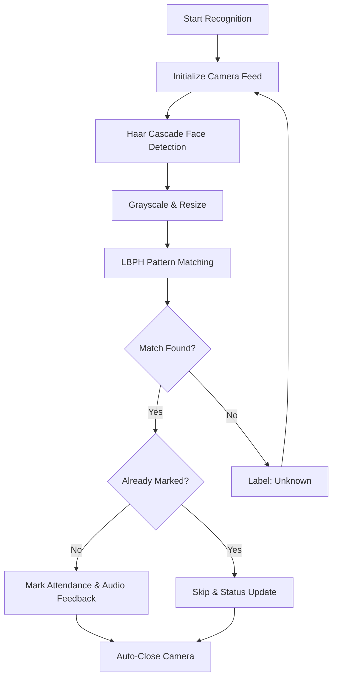

# 🎓 Face Recognition Attendance System

A **Python-based Face Recognition Attendance System** that automatically marks attendance using a live camera feed.
Built with **OpenCV**, **Tkinter**, and **MySQL**, featuring a modern GUI and auto-close camera logic for smooth operation.

---
### 🏗️ System Architecture & Logic Flow
This diagram illustrates the end-to-end pipeline, from raw camera frames to database updates.




## 🚀 Features

* 📷 Real-time face detection & recognition
* 🧠 LBPH Face Recognizer (OpenCV)
* ✅ Automatic attendance marking
* 🔁 Detects **already marked** students
* 🔊 Audio feedback on success / duplicate
* 🛑 **Auto-closes camera after recognition**
* 🖥️ Clean & modern Tkinter GUI
* 📊 Session logs & status indicators

---

## 🛠️ Tech Stack

* **Language:** Python 3.10+
* **GUI:** Tkinter
* **Computer Vision:** OpenCV (contrib)
* **Database:** MySQL
* **Image Processing:** Pillow
* **Math:** NumPy

> ℹ️ `Tkinter` comes bundled with Python (no pip install required)

---

## 📁 Project Structure

```
FaceRecognitionAttendanceSystem/
│
├── main.py
├── config.py
├── requirements.txt
├── README.md
│
├── models/
│   ├── haarcascade_frontalface_default.xml
│   └── classifier.xml
│
├── ui/
│   └── buttons.py
│
├── features/
│   ├── train.py
│   └── face_recognition.py
│
└── database/
    └── schema.sql
```

---

## ⚙️ Installation & Setup

### 1️⃣ Clone the repository

```bash
git clone https://github.com/YOUR_USERNAME/FaceAttendanceSystem.git
cd FaceAttendanceSystem
```

---

### 2️⃣ Create & activate virtual environment

```bash
python -m venv venv
venv\Scripts\activate
```

---

### 3️⃣ Install dependencies

```bash
pip install -r requirements.txt
```

---

### 4️⃣ Database setup (MySQL)

Create database:

```sql
CREATE DATABASE face_recognition;
```

Required tables:

```1. Create the Student Table
CREATE TABLE student (
    Student_ID VARCHAR(45) NOT NULL,
    Name VARCHAR(45),
    Department VARCHAR(45),
    Course VARCHAR(45),
    Year VARCHAR(45),
    Semester VARCHAR(45),
    Division VARCHAR(45),
    Gender VARCHAR(45),
    DOB VARCHAR(45),
    Mobile_No VARCHAR(45),
    Address VARCHAR(45),
    Roll_No VARCHAR(45),
    Email VARCHAR(45),
    Teacher_Name VARCHAR(45),
    PhotoSample VARCHAR(45),
    PRIMARY KEY (Student_ID)
);

2. Create the Attendance Table
-- Note: Uses a Composite Primary Key for std_id and std_date as shown in your screenshot.
CREATE TABLE stdattendance (
    std_id VARCHAR(45) NOT NULL,
    std_roll_no VARCHAR(45),
    std_name VARCHAR(45),
    std_time VARCHAR(45),
    std_date VARCHAR(45) NOT NULL,
    std_attendance VARCHAR(45),
    PRIMARY KEY (std_id, std_date)
); 

3. Create the Teacher Registration Table
CREATE TABLE regteach (
    fname VARCHAR(50) NOT NULL,
    lname VARCHAR(45),
    cnum VARCHAR(45),
    email VARCHAR(45),
    ssq VARCHAR(45), -- Security Question
    sa VARCHAR(45),  -- Security Answer
    pwd VARCHAR(45), -- Password
    PRIMARY KEY (fname)
);
```

* `student`
* `stdattendance`
* `regteach`

  

> Make sure MySQL credentials in code match your local setup.

---

### 5️⃣ Run the application

```bash
python main.py
```

---

## 🧪 How It Works

1. Camera starts on **Start Recognition**
2. Face detected and recognized using LBPH
3. Student details fetched from MySQL
4. Attendance marked automatically
5. Camera **auto-closes after successful recognition**
6. Attendance stored with date & time

---

## 📸 Screenshots

* Dashboard

* Live recognition screen
  

* Attendance log


---

## 🔐 Notes

* Ensure webcam access is enabled
* Run on **Windows** (uses `winsound`)
* Do **not upload `venv/` to GitHub**
* Model files must exist inside `models/`

---

## 📈 Future Improvements

* Multiple face attendance per session
* Cloud database support
* CSV / Excel export
* Face mask detection
* Admin login & role management

---

## 👨‍💻 Author

**Bhupesh Dewangan**
📌 Python | Computer Vision | GUI Applications

> This project was built for academic learning and practical implementation of face recognition systems.

---

## ⭐ Support

If you like this project:

* ⭐ Star the repository
* 🍴 Fork it
* 🧠 Use it for learning

---

